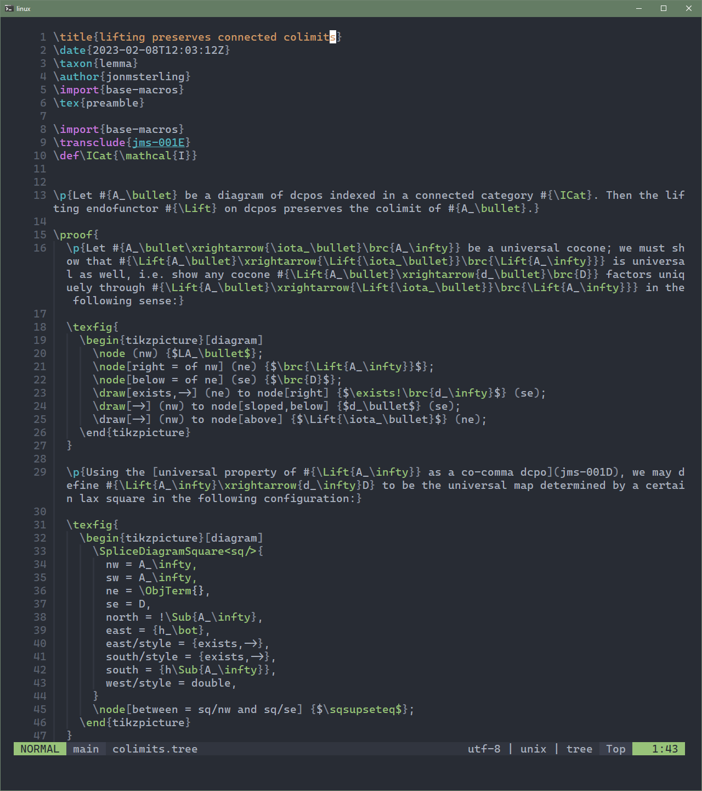

# 🌲 forester.nvim 🌲

Filetype plugin for [forester](https://sr.ht/~jonsterling/forester/), a tool
for writing mathematical hypertext

# Features

This plugin is pre-alpha, expect breaking changes.

- Tree-sitter syntax highlighting



  Please report any issues with the grammar in the [relevant repository](https://github.com/kentookura/tree-sitter-forester)

- following links and transclusions with `gf`

- Browsing forests with telescope

- Creating new trees within neovim

Available user commands:

- `Forester browse`: Telescope picker, search trees by title. TODO: support browsing by tag/taxon/...
- `Forester new`: Create a new tree by specifying a prefix
- `Forester transclude`: transclude a new tree at cursor position
- `Forester link`: link a new tree at cursor position


Streaming development on [twitch](https://twitch.tv/kento_okura)

# Installation

With lazy:

```lua
  {
    "kentookura/forester.nvim",
    dependencies = {
      { "nvim-treesitter/nvim-treesitter" },
      { "nvim-lua/plenary.nvim" },
      { "hrsh7th/nvim-cmp" },
    },
  },
```

# Configuration

```lua
{
  opts = {
    forests = { "~/forest/"},      -- Global forests
    tree_dirs = {"trees", "notes"} -- Where the plugin will look for trees relative to the current directory. 
  };                               -- Works outside of global forests

  config = function()
    local forester = require("forester")
    vim.g.mapleader = " "

    vim.keymap.set("n", "<leader>n.", "<cmd>Forester browse<CR>", { silent = true })
    vim.keymap.set("n", "<leader>nn", "<cmd>Forester new<CR>", { silent = true })
    vim.keymap.set("i", "<C-t>", "<cmd>Forester transclude<CR>", { silent = true })
    vim.keymap.set("i", "<C-l>", "<cmd>Forester link<CR>", { silent = true })
  end,
}

require("nvim-web-devicons").setup({ override_by_extension = { ["tree"] = { icon = "🌲" } } })
```


# Roadmap

- Adding more telescope pickers and previewers, making use of the `forester query` commands
- Link & transclude existing trees at cursor position.
- autocomplete
- ...
