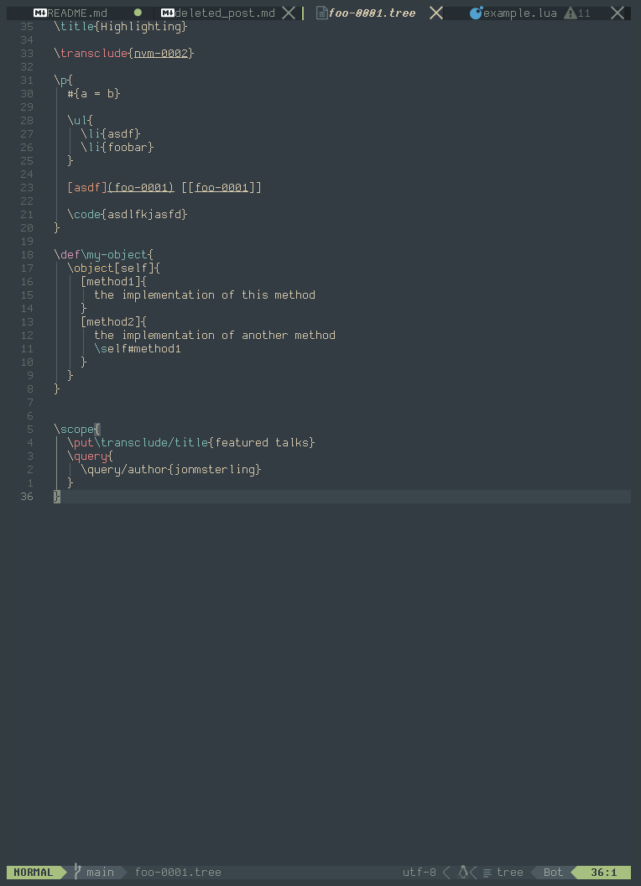
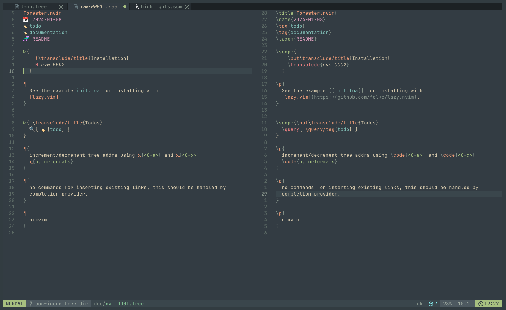

# forester.nvim

Filetype plugin for [forester](https://sr.ht/~jonsterling/forester/), a tool
for writing mathematical hypertext

## [Contributing/Roadmap](https://kentookura.srht.site/gld-000B.xml)

Currently assumes that trees are located in `./trees`.

## Features

### Tree-sitter syntax highlighting and concealing

### following links using `gf`

### searching titles using `<leader>n.`

### new trees `<leader>nn`

## Required dependencies

- [nvim-lua/plenary.nvim](https://github.com/nvim-lua/plenary.nvim)

`forester` needs to be in `$PATH`

## Installation

Should work with your favorite plugin manager. Please report any issues.
